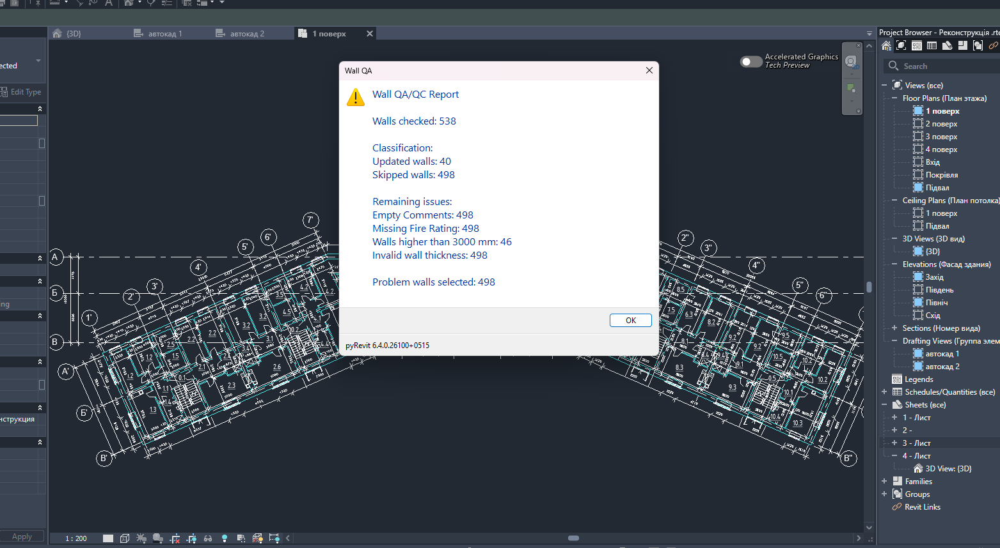

# Wall QA Manager for pyRevit

Wall classification and QA/QC tool for Revit using pyRevit and Python.

## Overview

Wall QA Manager helps classify and audit wall data inside Revit models.

The tool validates wall information based on predefined rules and supports QA/QC workflows for BIM projects.

## Features

- Wall classification by thickness
- Fire Rating assignment
- Comments parameter validation
- Height checking
- Audit and issue detection
- Element selection for review
- Full QA/QC workflow mode
- WPF user interface

Supported rules:

- 510 mm walls
- 380 mm walls
- 100 mm walls
- Fire Rating
- Height > 3000 mm

## Interface

### Tool Window

### Result Example

## Tech Stack

- Python
- pyRevit
- Revit API
- WPF / XAML
